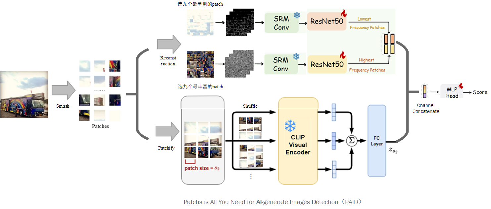

## Multi-Scale Semantic-Texture Detector(MSTD)
### 架构图v1.0



### 模块

2025年3月28日 第一次提交

整合三篇论文的核心思想，并提出一个创新的AI生成图像检测方法。这些论文分别是：

1. SFLD (主论文)：使用PatchShuffle整合高级语义和低级纹理信息，减少内容偏见
2. Sanity Check：提出了Chameleon数据集，揭示了现有检测器在高度逼真的AI生成图像上的失败，并提出了AIDE方法
3. PatchCraft：利用丰富和贫乏纹理区域之间的纹理对比

提出一种新的AI生成图像检测方法——多尺度语义-纹理融合检测器（Multi-Scale Semantic-Texture Detector，简称MSTD）。该方法整合了三篇论文的优势，并添加了创新性元素，以提高检测器对高度逼真AI生成图像的鲁棒性和泛化能力。

MSTD主要创新点在于：

1. **自适应多尺度特征提取**：不同于SFLD固定的patch大小，MSTD使用自适应策略动态选择最优patch尺寸
2. **层次化特征融合**：从低级频率特征到高级语义特征建立层次化特征表示
3. **对抗性特征增强**：引入对抗训练模块增强模型的鲁棒性
4. **自适应注意力机制**：根据图像内容动态调整不同特征的权重

### 创新点

1. **自适应patch选择**：动态确定最优patch大小，而不是使用固定大小。
2. **层次化特征融合**：建立从低级频率特征到高级语义特征的层次化表示。
3. **对抗性特征增强**：通过对抗训练提高模型的鲁棒性。
4. **自适应注意力机制**：根据图像内容动态调整不同特征的权重。
5. **频率域一致性分析**：添加空间域和频率域之间的一致性检查。

### 项目结构

```
mstd/
├── main.py               # 主入口文件，包含训练和评估功能
├── inference.py          # 单张图像推理脚本
├── models/               # 模型定义目录
│   ├── __init__.py       # 模型包初始化
│   ├── mstd.py           # MSTD主模型定义
│   ├── patch_operations.py  # 图像patch操作相关模块
│   ├── dct_transform.py  # DCT变换实现
│   ├── frequency_analysis.py # 频率分析模块
│   └── srm_filter_kernel.py # 噪声残差滤波器实现
├── utils/                # 工具函数目录
│   ├── dataset.py        # 数据集加载器
│   ├── metrics.py        # 评估指标计算
│   ├── logging.py        # 日志记录工具
│   └── augmentation.py   # 数据增强方法
├── data/                 # 数据集和资源
│   ├── datasets/         # 数据集存放目录
│   └── module.png        # 架构图
└── output/               # 输出结果和模型保存目录
```

### 框架流程

MSTD是一个多分支融合的AI生成图像检测框架，主要由以下几个部分组成：

1. **图像分块(Smash & Patches)**：
   - 使用滑动窗口方法从输入图像中提取固定大小的patches
   - 采用自适应步长策略以获取更多样的纹理信息

2. **频率域处理**：
   - **DCT变换**：将图像patches转换到频率域
   - **高/低频特征提取**：分别选取具有丰富高频和低频信息的patches
   - **SRM滤波**：使用噪声残差模型提取可能的伪造痕迹
   - **ResNet特征提取**：通过简化版ResNet50提取深层特征

3. **语义特征提取**：
   - **Patch随机打乱**：随机重排patches以减少内容偏见
   - **CLIP编码**：使用类CLIP视觉编码器提取语义特征

4. **特征融合与分类**：
   - 融合高频特征、低频特征和语义特征
   - 通过MLP输出二分类结果（真实/AI生成）

### 使用流程

1. **训练模式**：
   ```bash
   python main.py --mode train --data_root ./data --batch_size 32 --epochs 50
   ```

2. **评估模式**：
   ```bash
   python main.py --mode eval --resume ./output/best_model.pth
   ```

3. **推理模式**：
   ```bash
   python inference.py --image ./data/test.jpg --model ./output/best_model.pth
   ```